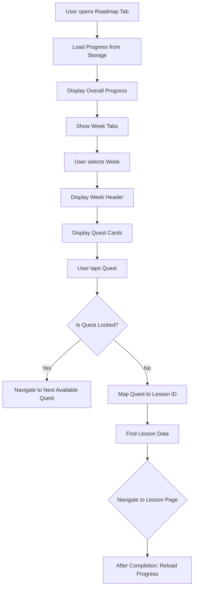
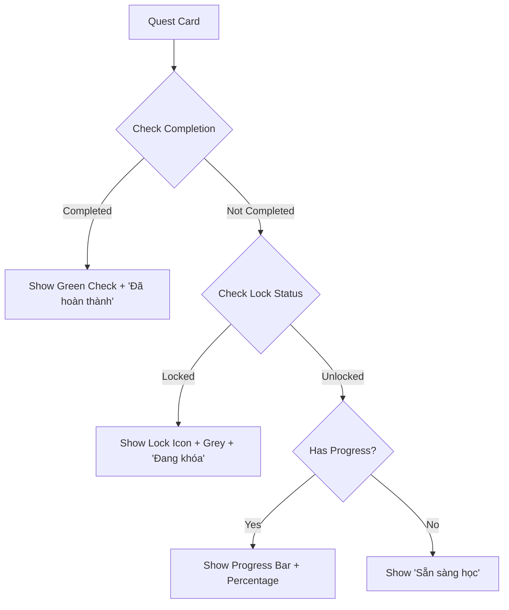

# Software Requirements Specification (SRS) - Roadmap Feature

## 1. Giới thiệu

### 1.1 Mục đích
Tài liệu này mô tả chi tiết các yêu cầu phần mềm cho tính năng Roadmap trong ứng dụng Japanlyze - một ứng dụng học tiếng Nhật N5. Roadmap cung cấp lộ trình học tập có cấu trúc, chia thành các tuần với các nhiệm vụ (quests) cụ thể để người dùng theo dõi tiến độ học tập từ cơ bản đến nâng cao.

### 1.2 Phạm vi
Roadmap bao gồm:
- Hiển thị tiến độ tổng thể
- Chọn tuần học
- Hiển thị danh sách nhiệm vụ trong tuần
- Điều hướng đến bài học tương ứng
- Quản lý trạng thái khóa/mở khóa nhiệm vụ
- Theo dõi tiến độ từng nhiệm vụ

### 1.3 Định nghĩa, Viết tắt
- Quest: Nhiệm vụ học tập
- Week: Tuần học
- Progress: Tiến độ hoàn thành
- Lock: Trạng thái khóa (không thể truy cập)

## 2. Mô tả tổng quan

### 2.1 Quan điểm sản phẩm
Roadmap là tính năng cốt lõi giúp người dùng:
- Hiểu rõ lộ trình học tập N5 (11 tuần)
- Theo dõi tiến độ cá nhân
- Truy cập bài học theo thứ tự logic
- Nhận động lực qua visual progress

### 2.2 Chức năng chính
1. Hiển thị progress bar tổng thể
2. Chọn tuần học qua tab
3. Hiển thị header tuần với thông tin
4. Danh sách quest cards với trạng thái
5. Navigation đến lesson pages
6. Auto-lock/unlock quests dựa trên progress

### 2.3 Đặc điểm người dùng
- Người học tiếng Nhật N5
- Độ tuổi: 18-35
- Kinh nghiệm công nghệ: Trung bình
- Mục tiêu: Học tiếng Nhật có hệ thống

## 3. Yêu cầu chức năng

### 3.1 Quản lý tiến độ

#### 3.1.1 Load tiến độ
- **Mô tả**: Khi vào tab roadmap, load completed quests và progress từ local storage
- **Input**: Không
- **Output**: Set completedQuestIds, questProgress
- **Logic**: 
  - Gọi UserProgressService().getCompletedLessons()
  - Gọi UserProgressService().getAllQuestProgress()
  - Update state và rebuild UI

#### 3.1.2 Tính toán progress
- **Mô tả**: Tính % hoàn thành cho tuần và tổng thể
- **Công thức**: (completed / total) * 100
- **Logic**: RoadmapUtils.calculateProgress()

### 3.2 Logic khóa/mở khóa quest

#### 3.2.1 Quy tắc khóa
- Quest đầu tiên luôn mở
- Quest bị khóa nếu quest trước chưa hoàn thành
- **Logic**: 
  ```dart
  bool isQuestLocked(RoadmapQuest quest, Set<String> completedQuestIds) {
    // Tìm index quest trong danh sách tất cả quests
    // Nếu index <= 0: return false
    // Nếu quest trước chưa complete: return true
  }
  ```

#### 3.2.2 Navigation khi quest khóa
- Khi tap quest khóa: Chuyển đến quest available gần nhất
- Hiển thị SnackBar thông báo

### 3.3 Mapping quest to lesson

#### 3.3.1 Map link to ID
- **Logic**: RoadmapUtils.mapLinkToId()
- **Rules**:
  - hiragana -> 'hiragana'
  - katakana -> 'katakana'  
  - lesson=lesson1 -> 'conv_1_intro'
  - lesson=lesson2 -> 'conv_2_hometown'
  - etc.
  - Fallback: extract last part of path

#### 3.3.2 Navigate to lesson page
- Tìm lesson data từ conversationData
- Nếu type == 'flashcard': FlashcardPage
- Else: ConversationLessonPage
- Sau khi complete: reload progress

### 3.4 UI Components

#### 3.4.1 Overall Progress Bar
- **Widget**: OverallProgressBar
- **Props**: completedQuestIds
- **UI**: Linear gradient bar (primary -> secondary)
- **Logic**: widthFactor = completed/total, min 0.01

#### 3.4.2 Overall Progress Badge
- **Widget**: OverallProgressBadge  
- **Props**: completedQuestIds, isLoading
- **UI**: 
  - Loading: CircularProgressIndicator
  - Normal: "XX%" + "completed/total nhiệm vụ"

#### 3.4.3 Week Tab
- **Widget**: WeekTab
- **Props**: weekNumber, isSelected, iconColor, onTap
- **UI**: 
  - Selected: background = iconColor, shadow
  - Unselected: white/transparent background
  - Text: "X Tuần"

#### 3.4.4 Week Header
- **Widget**: WeekHeader
- **Props**: week, completedQuestIds
- **UI**:
  - Background: week.color with alpha
  - Icon: calendar_today in colored container
  - Title, description
  - Progress: "XX%" + "completed/total"

#### 3.4.5 Quest Card
- **Widget**: QuestCard
- **Props**: quest, week, completedQuestIds, progress, onTap
- **States**:
  - Locked: grey background, lock icon, "Đang khóa"
  - Done: green border, check icon, "Đã hoàn thành"  
  - Available: normal card, "Sẵn sàng học", progress bar if >0
- **Interactions**: 
  - Tap: haptic feedback, scale animation
  - Visual feedback: pressed state

## 4. Yêu cầu phi chức năng

### 4.1 Hiệu suất
- Load progress: < 500ms
- UI render: 60fps
- Memory: < 50MB cho roadmap data

### 4.2 Khả năng sử dụng
- Responsive: support mobile, tablet
- Dark mode: full support
- Accessibility: proper contrast, touch targets

### 4.3 Bảo mật
- Local storage: encrypted user progress
- No sensitive data exposure

## 5. Giao diện người dùng (UI/UX)

### 5.1 Layout chính
```
[AppBar - Pinned]
  Title: "Lộ trình N5 🗻"
  Progress Badge: "XX% completed/total"
  Progress Bar: [████████░░] 

[Week Tabs - Horizontal Scroll]
  [Tuần 1] [Tuần 2] [Tuần 3] ...

[Week Content]
  [Week Header Card]
    Icon + Title + Description + Progress
  
  [Quest Cards List]
    [Quest 1] - Available/Done/Locked
    [Quest 2] - Available/Done/Locked
    ...
```

### 5.2 Color Scheme
- Primary: AppColors.primary (blue)
- Secondary: AppColors.secondary  
- Success: Green
- Locked: Grey
- Week colors: Unique per week

### 5.3 Typography
- Title: Lexend Bold 24pt
- Subtitle: Lexend 12pt grey
- Card title: Lexend Bold 15pt
- Status: 12pt with weight variations

### 5.4 Animations
- Tab selection: 200ms color transition
- Quest tap: 100ms scale (0.98)
- Progress bar: smooth fill animation

## 6. Luồng hoạt động (Flow)

### 6.1 Main Flow


### 6.2 Quest State Flow


### 6.3 Progress Calculation Flow
```mermaid
graph TD
    A[Completed Quest IDs] --> B[Intersect with Roadmap Quest IDs]
    B --> C[Count Intersections = Completed Count]
    C --> D[Total Quest Count from Roadmap]
    D --> E[Percentage = (Completed / Total) * 100]
    E --> F[Display in Badge + Bar]
```

## 7. Yêu cầu cải tiến

### 7.1 Logic Improvements
1. **Quest Dependencies**: Hiện tại chỉ phụ thuộc quest trước. Cải tiến thành dependency graph phức tạp hơn.
2. **Progress Granularity**: Thêm sub-progress trong quest (ví dụ: 3/5 bài tập con).
3. **Streak Tracking**: Theo dõi chuỗi ngày học liên tiếp.
4. **Adaptive Unlocking**: Unlock dựa trên thời gian hoặc performance, không chỉ completion.

### 7.2 UI Improvements  
1. **Quest Categories**: Group quests by type (grammar, vocab, conversation).
2. **Visual Progress**: Thêm icons, badges cho achievements.
3. **Interactive Elements**: Drag-drop để reorder, swipe để mark complete.
4. **Gamification**: Points, levels, rewards system.

### 7.3 Flow Improvements
1. **Onboarding**: Tutorial cho new users về cách sử dụng roadmap.
2. **Notifications**: Remind users về quests chưa hoàn thành.
3. **Analytics**: Track user engagement, drop-off points.
4. **Personalization**: Adaptive roadmap dựa trên learning style.

### 7.4 Performance Improvements
1. **Lazy Loading**: Load quest data on demand.
2. **Caching**: Cache progress data locally with sync.
3. **Background Sync**: Sync progress with server periodically.
4. **Offline Support**: Allow progress tracking offline.

## 8. Test Cases

### 8.1 Unit Tests
- RoadmapUtils.isQuestLocked()
- RoadmapUtils.calculateProgress()
- RoadmapUtils.mapLinkToId()

### 8.2 Integration Tests  
- Progress loading from UserProgressService
- Navigation to lesson pages
- State updates after lesson completion

### 8.3 UI Tests
- Quest card states (locked/available/done)
- Progress bar animations
- Tab switching
- Dark/light mode

## 9. Phụ lục

### 9.1 Data Models
```dart
class RoadmapWeek {
  final int week;
  final String title;
  final String description; 
  final Color color;
  final Color iconColor;
  final List<RoadmapQuest> quests;
}

class RoadmapQuest {
  final String id;
  final String title;
  final String link;
  final String type; // 'conversation' | 'flashcard'
  final IconData icon;
}
```

### 9.2 Dependencies
- UserProgressService: getCompletedLessons(), getAllQuestProgress()
- conversationData: List of lesson data
- n5Weeks: Predefined roadmap data</content>
<parameter name="filePath">d:\backup\Japanlyze\japanlyze_app\SRS_Roadmap.md